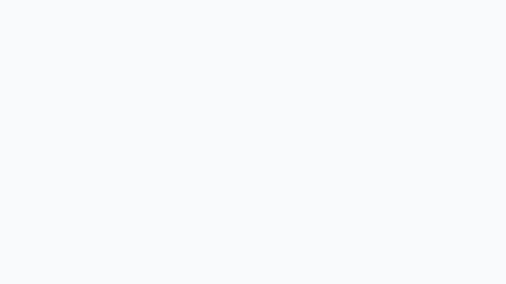

<div align="center">

# wgmik-server

**A self-hosted WireGuard accounting & management panel for MikroTik RouterOS.**

Track per-peer usage, enforce fair-usage quotas, manage peers across multiple routers, and let users check their own usage from Telegram — all from one clean, modern panel.



</div>

---

## Why

RouterOS gives you WireGuard, but no real visibility: no history, no quotas, no per-peer accounting, no way to hand usage info to your users. `wgmik-server` sits next to your router(s), polls them on a schedule, and turns raw interface counters into a usable panel — without touching your router config beyond what you ask it to.

It's built to be **simple to run** (one `docker compose up` — or [directly on the router itself](#run-on-a-mikrotik-router-routeros-723) via RouterOS Apps), **robust** (encrypted secrets, DB recovery tooling, crash-safe maintenance), and **nice to look at** (modern React UI, light/dark, live charts).

## Features

**Routers & peers**
- Manage **multiple RouterOS routers** from one panel (REST or legacy API, with version auto-detection).
- Import existing WireGuard peers, add new ones, edit, rename, delete, and renew keys.
- Generate and export ready-to-use client configs, with per-peer export preferences.
- Live online/offline status with a configurable "online" threshold.

**Usage accounting**
- Background polling turns interface counters into real **per-peer usage history**.
- Today / monthly / all-time views, monthly summaries, and per-router breakdowns.
- Live traffic **charts** (TX/RX) on the dashboard and per peer.
- Configurable monthly reset day and timezone.

**Fair usage & quotas**
- Define **fair-usage rules and tiers**, assign them to peers, and let the panel enforce quotas automatically.
- Quota warnings at 80% / 90%, quota-hit and quota-lifted events.
- Per-peer quota status and one-click reset.

**Telegram bot (self-service for your users)**
- Users link their peer via a one-time **deep-link signup token** — no accounts to hand out.
- Commands: `/today`, `/monthly`, `/alltime`, `/calendar`, `/fair`, `/settings`.
- Rendered usage **charts and images** delivered straight in chat — generated in-process (SVG → PNG), no headless browser.
- Push **notifications**: quota warnings and throttle alerts with fair-usage status cards, daily and weekly summaries with charts.
- **Admin menu** (`/admin`): aggregate dashboard reports (today / month / all-time) and per-user reports.
- **Multi-language** (i18n) and **Jalali / Gregorian** calendar support.

**Admin & operations**
- Multiple admin users, password resets, forced password change on first login.
- Scheduled background jobs (polling, daily/weekly summaries, automated usage maintenance) with hot-reloadable intervals.
- An **exclusive-operation gate** that safely locks the app during destructive/maintenance work instead of corrupting data.
- DB recovery and diagnostic tooling in `bin/` for when things go wrong.

**Built-in by default**
- Secrets at rest (RouterOS passwords, WireGuard keys, Telegram token) are **encrypted**.
- No admin password in logs, no secrets in config files.
- Light/dark theme that follows your OS.

## Quickstart

**Requirements:** Docker + Docker Compose.

```bash
git clone https://github.com/parhamfa/wgmik-server.git
cd wgmik-server
docker compose pull   # fetch prebuilt images from GHCR
docker compose up -d
```

That's it — no `.env` to edit, no secrets to generate, nothing to compile. The prebuilt image is published to GitHub Container Registry (`ghcr.io/parhamfa/wgmik-server`), so you only download what changed.

> Prefer to **build from source** instead of pulling? Use `docker compose up --build` — same compose file, it just builds the image locally.

- **Web UI + API:** http://localhost:6574

### First run

1. Open http://localhost:6574 — on a fresh install you land on **Create admin account**.
2. Pick a username and a password (min 12 characters). You're logged in immediately.
3. The setup wizard walks you through connecting a RouterOS profile and importing peers.

Your SQLite database and the auto-generated encryption key are persisted in `./data` (bind-mounted), so everything survives restarts.

Stop the stack:

```bash
docker compose down
```

## Configuration (all optional)

A fresh install needs no configuration. To override a default, copy `env.example` to `.env` and uncomment what you need.

| Variable | Purpose |
|---|---|
| `SECRET_KEY` | Signs login sessions **and** derives the key that encrypts stored RouterOS/WireGuard/Telegram secrets. Left unset, a strong key is generated on first boot and persisted to `/data/secret_key`. Set a fixed value only for advanced/multi-instance deployments. |
| `DATABASE_URL` | Defaults to the SQLite DB in the data volume. |
| `DEBUG` | FastAPI debug + verbose logs. |

> **Do not change `SECRET_KEY` on an existing install.** It encrypts stored secrets — changing it makes previously saved RouterOS/WireGuard/Telegram credentials undecryptable, and they'd need to be re-entered.

## Updating

Your data lives in `./data` (DB + encryption key) and is never touched by an update. Schema changes are applied automatically on startup, so there's no manual migration step.

```bash
# Optional but recommended: back up your data first
cp -r data data.backup-$(date +%Y%m%d)

git pull
docker compose pull     # grab the new prebuilt image (only changed layers)
docker compose up -d
```

Building from source instead? Replace the pull with `docker compose up --build -d`. Docker's layer cache means packages are only re-downloaded when `package-lock.json` / `requirements.txt` actually change — avoid `--no-cache` for routine updates.

To pin a specific release instead of tracking the latest image, set `WGMIK_TAG` (e.g. `WGMIK_TAG=v1.0.0 docker compose up -d`).

## Run on a MikroTik router (RouterOS 7.23+)

Besides normal Docker hosting, wgmik-server can run **directly on a container-capable MikroTik router** using the RouterOS [Apps](https://help.mikrotik.com/docs/spaces/ROS/pages/343244823/Apps) feature. The published image is multi-arch (`amd64` + `arm64`), so it works on ARM64 MikroTik hardware.

This procedure was validated end-to-end on a RouterOS 7.23.1 CHR. Every command below is copy-pasteable into the RouterOS terminal.

### Prerequisites

- RouterOS **7.23 or newer** with the `container` package installed (check with `/system package print` — install it from the Extra packages zip for your architecture if missing).
- An ARM64 or x86/CHR device that supports containers — e.g. RB5009, CCR2004/2116, hAP ax series. **≥1 GB RAM recommended** (runs on 512 MB, but with little headroom).
- A storage disk with ~500 MB free: USB / NVMe / SATA, or a second virtual disk on CHR. The image alone is ~250 MB on disk.

### Step 1 — Enable container support (one-time)

```
/system/device-mode update container=yes
```

On physical routers, confirm by power-cycling or pressing the reset button **within 5 minutes**. On CHR, a reboot is enough. Verify afterwards: `/system/device-mode print` should show `container: yes`.

### Step 2 — Prepare storage

Find your disk and format it if it has no filesystem (`FS` column empty in `/disk print`):

```
/disk print
/disk format <slot> file-system=ext4     # e.g. /disk format usb1 file-system=ext4 — ERASES the disk!
```

Then tell the App system to use it (storage is a global App setting, not per-app):

```
/app/settings set disk=<slot>
```

Alternatively, run the interactive wizard `/app setup` (or the Setup button in WinBox/WebFig), which walks through disk and bridge selection.

### Step 3 — Add the app

Fetch the app definition straight from this repo and register it:

```
/tool fetch url="https://raw.githubusercontent.com/parhamfa/wgmik-server/main/deploy/mikrotik/wgmik.tikapp.yaml" dst-path=wgmik.tikapp.yaml
/app add yaml=[/file get wgmik.tikapp.yaml contents]
```

No file transfer tools needed. (If your router has no internet access to GitHub, upload the file via WinBox/scp first — the `/app add` line is the same.)

### Step 4 — Enable it

If your router doesn't use MikroTik cloud services (or you just don't want the cloud reverse-proxy URL), turn off HTTPS for the app first — otherwise it can hang at status `wait for reverse proxy`:

```
/app set [find name="wgmik-server"] use-https=no
/app enable wgmik-server
```

Note: the lifecycle commands are `enable` / `disable` — there is no `start`.

Watch progress — it pulls ~100 MB from `ghcr.io` and extracts it:

```
/app print
```

Status goes `downloading/extracting` → running (flag `R`). A few minutes on a decent connection.

### Step 5 — First-run setup

Open `http://<router-ip>:6574` and create your admin account as usual.

When the setup wizard asks for the RouterOS connection, remember the panel runs *inside* the router now:

- Use the **router's own LAN/bridge IP** as the host — never `localhost` (the container has its own network namespace).
- Make sure the API or REST service is enabled in `/ip service` for the chosen protocol.

RouterOS handles the veth interface, NAT, and the 6574 port-forward automatically — no manual container networking.

### Troubleshooting

| Symptom | Fix |
|---|---|
| `bad parameter` on `/app add file=...` | There is no `file=` parameter — use `yaml=[/file get <name> contents]` |
| Status stuck at `wait for reverse proxy` | `/app set [find name="wgmik-server"] use-https=no`, then disable/enable |
| App won't enable, storage errors | `/app/settings print` — `disk` must be set; the disk must be formatted and mounted (`/disk print` shows flag `M`) |
| `no matching manifest` on pull | Your RouterOS architecture isn't amd64/arm64 (armv7 devices are not supported) |
| Out of memory / app killed | Device has too little free RAM; 512 MB is the floor, 1 GB+ recommended |

### Data and lifecycle

- Your data (SQLite DB, encryption key, backups) lives in the `wgmik/data` directory on the app disk and survives restarts and image updates (`/app update`).
- **`/app cleanup wgmik-server` permanently deletes all app data** — copy `wgmik/data` off the router first if you need a backup.
- The Let's Encrypt TLS wizard inside the panel needs public TCP/80 reachable on the router; the self-signed option works without it.
- Be careful with firewall changes made through the panel: a bad rule can cut the panel off from the router it runs on.

## Dev mode (hot reload)

Single container — Vite and uvicorn run together with bind mounts for hot reload.

```bash
docker compose -f docker-compose.dev.yml up --build
```

- **Web UI (Vite):** http://localhost:6574
- **API (uvicorn --reload):** http://localhost:6575

Stop:

```bash
docker compose -f docker-compose.dev.yml down
```

## Tech stack

- **Backend:** FastAPI (Python), SQLAlchemy, APScheduler, SQLite. Telegram card/chart images are rendered with [resvg](https://github.com/baseplate-admin/resvg-py) (no Chromium/Playwright).
- **Frontend:** React + Vite + TypeScript + Tailwind.
- **Delivery:** Docker Compose with a single prebuilt multi-arch image (`amd64` + `arm64`) on GHCR (GitHub Actions CI). FastAPI serves the built frontend and API on one port (6574), healthchecks, and single-volume persistence. The same image runs on container-capable MikroTik routers via RouterOS Apps.

## Verify after boot

- **Health:** http://localhost:6574/health returns `{"status": "ok"}`.
- **First run:** the web UI shows the Create admin account screen, then the router setup wizard.
- **Restart:** `docker compose down && docker compose up` keeps your admin account and skips setup.
- **Router test:** Settings → Connection profiles → Test returns OK (or a clear error).
- **No secrets in logs:** `docker compose logs api` contains no admin password.
